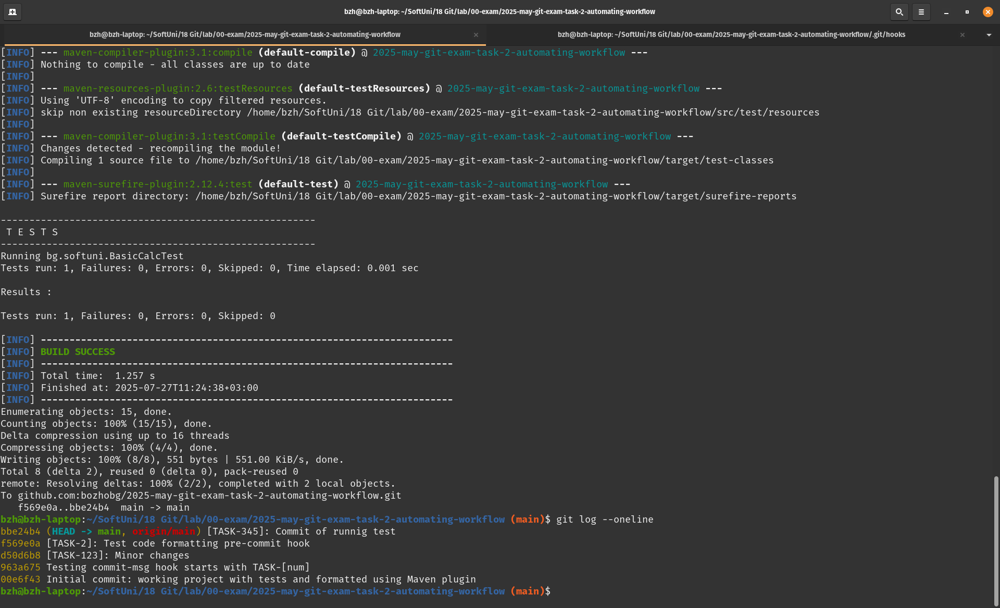

## Automating Workflow with Git Hooks and CI/CD
Integration

1. Initial state of project - succeeding tests and formatted code (Maven spotless plugin)


2. Adding commit-msg hook to look for format of '[TASK-123]'
    .git/hooks/commit-msg
```
#!/bin/sh
# commit-msg hook script to enforce message format
if ! grep -q '^\[TASK-[0-9]\+\]' "$1"; then
  echo "Commit message must start with a TASK ticket reference, e.g., [TASK-123]: Your message"
  exit 1
fi
```

3. Checking using code formatter with pre-commit hook
```
#!/bin/sh
# Run spotless before commit
echo "Running spotless code formatting check..."

mvn spotless:check

if [ $? -ne 0 ]; then
	echo "Spotless errors found. Commit aborted."
	echo "Run: mvn spotless:apply to reformat code to standard"
	exit 1
fi
```


4. Check if tests pass before push
```
#!/bin/sh
# Run unit tests before pushing 

echo "Running test before push"

mvn test

if [ $? -ne 0 ]; then
	echo "Tests failed. Push aborted."
	exit 1
fi
```


5. Simulating pull request with broken tests - GH Actions to run tests on pull request
ci.yaml:
```
name: CI Pipeline
on: [pull_request]
jobs:
  build:
    runs-on: ubuntu-latest
    steps:
      - name: Checkout Code
        uses: actions/checkout@v4
      - name: Set up JDK Amazon Corretto 21
        uses: actions/setup-java@v4
        with:
          java-version: '21'
          distribution: 'corretto'
          cache: maven
      - name: Run the Maven Verify phase
        run: mvn --batch-mode --update-snapshots verify
```


6. git log and git reflog
